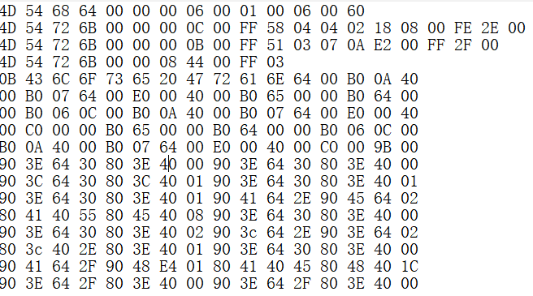
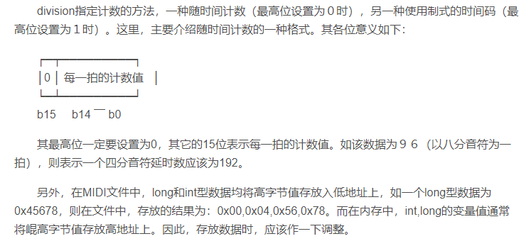
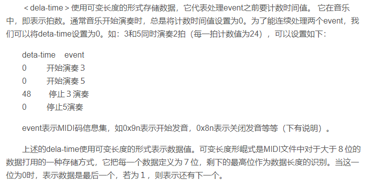

reference:
https://www.midifan.com/modulearticle-detailview-901.htm


# 关于MIDI文件格式
目前已知的：
1. .mid文件属于二进制文件，可以通过电脑或者手机上的音乐播放器直接播放。
2. 若需要阅读（观看）midi格式文件，可以使用binary viewer等二进制读取器打开。

通过研究，格式如下：

## 文件格式
主要包含两部分：**首部块（Header chunk）**，**音轨块（track chunk）**。
其格式分别为：

MThd <数据长度> <Header数据>   //首部块
MTrk <数据长度> <Track模块>       //音轨块

例如读取到的：

其中：
### Header Chunk
```c
/* 
4D 54 68 64 
00 00 00 06 
00 01                 ff ff
00 06                 nn nn 指定轨道数：实际音轨数加上全局的音轨
00 60                 dd dd指定基本时间：一般为120 （00 78），即一个四分音符的tick数，tick是MIDI中的最小时间单位
*/

char Midild[4];  //MIDI文件头标志，一般为MThd 
long length;     //文件首部数据长度（除它本身和文件头标志专用的字节以外），通常他设置为6，即下面三个部分的字节长度
int format;        //表示MIDI文件存放的格式，包括：                                
// 0）当format为0时只有一个Track Chunk，
// 1）当format为1时有一个或多个Track Chunk
// 2）当format为2时只有一个或多个各自独立的Track Chunk
int TrackNum; 
int division;   //指定了计数的方法

```
其中对于division的详细说明：


> 在上面我们注意到以下问题：上面的数据结构默认了：long类型是4Byte，int为2Byte，char为1Byte。

### 音轨块 track chunk
音轨块用来播放音乐文件的数据信息，每一个track chunk对应着一组MIDI码，它由**头部信息和若干个音轨事件（mtrk event）**构成。
头部为：
```c
/* 头部信息
4D 54 72 6B      ASCII：Mtrk
00 00 00 0C                 表示后面有12位的数据
*/
/*
00 FF 58 04 04 02 18 08 00 FE 2E 00 


*/

char TrackChunkId[4];      //Track Chunk标志MTrk
long TrackChunkMsgLength;  //该Track Chunk信息长度
```
Mtrk event是由事件计数值（dela-time）和event(MIDI码信息)组合而成的，即
< Mtrk > = < dela-time > < event >

### 使用WriteLengthToBuf()函数
目的是为了完成时间值二进制的转换

## 源代码（这个C代码不是我写的，但是值得学习）

```c
　　#include ＜stdlib.h＞
　　#include ＜stdio.h＞
　　#include ＜io.h＞
　　#include ＜string.h＞
　　#define C1 60 //C调1的键名值
　　#define FOURPAINUM 64 //1/4音符计数
　　#define MIDICLOCK 24 //每1/64音符的MIDICLOCK数
　　#define JumpNullChar(x) / //跳过空字符
　　 { /
　　 while(*x==' ' /
　　 ||*x=='/t' /
　　 ||*x=='/n' /
　　 ||*x=='|') /
　　 x++; /
　　 };
　　enum ERRORCODE{ //处理错误信息
　　 ChangeOK, //转换成功
　　 TextFileNotOpen, //文本文件不能打开
　　 MidiFileCanNotCreate, //指定的MIDI文件不能建立
　　 TextFileToBig, //文本文件太大
　　 MallocError, //内存分配错误
　　 InvalideChar, //在文本文件中出现了非法字符
　　 NotFoundTrack, //没有找到指定的磁道信息
　　 NotMIDITextFile, //文本文件不是MIDI文本文件
　　 };
　　void SWAP(char *x,char *y) //两数据交换
　　{ char i;
　　 i=*x;
　　 *x=*y;
　　 *y=i;
　　}
　　union LENGHT
　　{ long length;
　　char b[4];
　　} ;
　　struct MH { //MIDI文件头
　　char MidiId[4]; //MIDI文件标志MThd
　　long length; //头部信息长度
　　int format; //存放的格式
　　int ntracks; //磁道数目
　　int PerPaiNum; //每节计算器值
　　};
　　struct TH //音轨头
　　{ char TrackId[4]; //磁道标志MTrk
　　 long length; //信息长度
　　} ;
　　class MIDI
　　{
　　public:
　　char ErrorMsg[100]; //错误信息
　　private:
　　unsigned char *TextFileBuf,
　　 *TextFileOldBuf;
　　unsigned char *MidiFileBuf,
　　 *MidiFileOldBuf;
　　char OneVal; //某调时,1的健值
　　char PaiNum; //第一小节节拍总数
　　char OnePaiToneNum; //用几分音符作为一基本拍
　　public:
　　//将符全MIDI书定格式的文本文件生成MIDI文件
　　int ChangeTextToMidi(char *TextFileName,
　　 char *MidiFileName);
　　char *GetErrorMsg() //获取错误信息
　　 { return(ErrorMsg);}
　　private:
　　char GetCurPaiSpeed(int n); //取当前拍的按下强度
　　void WriteSoundSize(char ntrack,unsigned int );
　　void SetOnePaiToneNum(int n)
　　 { OnePaiToneNum=n; };
　　void SetOneVal(char *m) ; //取m大调或小调时,1的实际键值
　　char GetToneNum(char c, //取记名对应的键值
　　 char flag) ;
　　void WriteMHToFile(long length, //建立MIDI文件头
　　 int format,
　　 int ntracks,
　　 int PerPaiNum,
　　 FILE *fp);
　　void WriteTHToFile(long lenght,
　　 FILE *fp); //建立MIDI磁道头
　　void WriteTrackMsgToFile(FILE *fp);
　　//将磁道音乐信息定入文件中
　　void WriteSpeed(int speed);
　　void SetPaiNum(int n)
　　 { PaiNum=n;}
　　long NewLong(long n); //新的long值
　　int NewInt(int n) //新的int值
　　 { return(n＜＜8|n＞＞8);}
　　//将n改为可变长度,内入buf处
　　void WriteLenghtToBuf(unsigned long n,
　　 char *buf);
　　void ChangePrommgram(char channel, //设置音色
　　 char promgram);
　　void NoteOn (char n, //演奏乐音
　　 char speed,
　　 unsigned long delaytime);
　　void WriteNoteOn(char,char,char ,unsigned long) ;
　　void WriteTextMsg(char *msg); //定一串文本信息
　　void WriteTimeSignature(char n, //设置时间信息
　　 char d);
　　void WriteTrackEndMsg(); //设置磁道结束信息
　　};

　　/**************************************************
　　/* 作用:将符合MIDI文本文件的text文件转换成MIDI */
　　/* 文件. */
　　/* 入口参数:TextFileName 文本文件名 */
　　/* MidiFileName MIDI文件名 */
　　/* 出口参数:见 ERRORCODE 说明 */
　　/*************************************************/
　　int MIDI::ChangeTextToMidi(char *TextFileName,
　　char *MidiFileName)
　　{ int tracks,ntrack,delaytime;
　　int speed,IsFirst,nn,dd;
　　unsigned char buf[80],*msgbuf,c;
　　FILE *TextFp,*MidiFp;
　　long FileSize;
　　char SpeedVal;
　　TextFp=fopen(TextFileName,"r");
　　if (TextFp==NULL)
　　{sprintf(ErrorMsg,
　　"文本文件[%s]不能打开。/n",TextFileName);
　　 return(TextFileNotOpen);
　　 }
　　fseek(TextFp,0,SEEK_END); /*测试文件大小*/
　　FileSize=ftell(TextFp);
　　TextFileBuf=(char *)malloc(FileSize);/*为文件分配内存*/
　　if (TextFileBuf==NULL)
　　{ sprintf(ErrorMsg,
　　"文本文件[%s]太大，没有足够的内存处理。/n",
　　TextFileName);
　　 fclose(TextFp);
　　 return(TextFileToBig);
　　}
　　memset(TextFileBuf,0,FileSize);
　　MidiFileBuf=(char *) malloc(FileSize*4);
　　if ( MidiFileBuf==NULL)
　　{ sprintf(ErrorMsg,"不能为MIDI文件分配内存。/n");
　　fclose(TextFp);
　　free(TextFileBuf);
　　return(MallocError);
　　}
　　MidiFp=fopen(MidiFileName,"wb");
　　if (MidiFp==NULL)
　　 { sprintf(ErrorMsg,
　　"Midi文件[%s]不能建立。/n",MidiFileName);
　　 fclose(TextFp);
　　 free(MidiFileBuf);
　　 free(TextFileBuf);
　　 return(MidiFileCanNotCreate);
　　 }
　　MidiFileOldBuf=MidiFileBuf;
　　TextFileOldBuf=TextFileBuf;
　　fseek(TextFp,0,SEEK_SET);
　　fread(TextFileBuf,FileSize,1,TextFp);
　　fclose(TextFp);
　　JumpNullChar(TextFileBuf);
　　c=strnicmp(TextFileBuf,"[MIDI]",6);
　　if (c)
　　{sprintf(ErrorMsg,
　　"文本文件[%s]不是MIDI文本文件。/n",MidiFileName);
　　fcloseall();
　　free(TextFileOldBuf);
　　free(MidiFileOldBuf);
　　return(NotMIDITextFile);
　　}
　　TextFileBuf+=6;
　　JumpNullChar(TextFileBuf);
　　sscanf(TextFileBuf,"%c,%d/%d,%d,%d", //取调号等信息
　　c,nn,dd,speed,tracks);
　　buf[0]=c;buf[1]=0; SetOneVal(buf); //设置该调1的键值
　　if (nn＜1 || nn＞ 7) nn=4;
　　if (dd＜2 || dd＞16) dd=4;
　　while(*TextFileBuf!='/n') TextfileBuf++;
　　JumpNullChar(TextFileBuf);
　　if (speed＜60 || speed ＞200) speed=120;
　　JumpNullChar(TextFileBuf);
　　if (tracks＜1 || tracks＞16) tracks=1;
　　JumpNullChar(TextFileBuf);
　　ntrack=1;
　　WriteMHToFile(6,1,tracks,speed,MidiFp);
　　WriteTimeSignature(nn,dd); //设置时间记录格式
　　SetPaiNum(nn);
　　WriteSpeed(speed); //设置演奏速度
　　while(ntrack＜=tracks *TextFileBuf!=0)
　　{sprintf(buf,"[%d]",ntrack);
　　TextFileBuf=strstr(TextFileBuf,buf);//查找该磁道起始位置
　　if (TextFileBuf==NULL) //没有找到
　　{ sprintf(ErrorMsg,
　　"在文件[%s]中，第%d磁道音乐信息没找到。/n.",
　　 TextFileName,ntrack);
　　 free(MidiFileOldBuf);
　　 free(TextFileOldBuf);
　　 fcloseall();
　　 return(NotFoundTrack);
　　}
　　if (ntrack!=1) MidiFileBuf=MidiFileOldBuf;
　　SpeedVal=0;
　　TextFileBuf+=strlen(buf);
　　IsFirst=1;
　　while(*TextFileBuf!=0 *TextFileBuf!='[')
　　{ JumpNullChar(TextFileBuf);
　　c=*(TextFileBuf++);
　　if ( (c＞='0' c＜='7')
　　|| (c＞='a' c＜='g')
　　|| (c＞='A' c＜='G')
　　)
　　{JumpNullChar(TextFileBuf);
　　 if (*TextFileBuf=='b' || *TextFileBuf=='#')
　　 { c=GetToneNum(c,*TextFileBuf);/*取出实际的音符*/
　　 TextFileBuf++;
　　 JumpNullChar(TextFileBuf);
　　 }
　　 else c=GetToneNum(c,' ');
　　switch(*(TextFileBuf++))
　　 { case '-': //延长一拍
　　 delaytime=2*FOURPAINUM;
　　 JumpNullChar(TextFileBuf);
　　 while(*TextFileBuf=='-')
　　 { TextFileBuf++;
　　 delaytime+=FOURPAINUM;
　　 JumpNullChar(TextFileBuf);
　　 }
　　 break;
　　 case '_': //8分音符
　　 delaytime=FOURPAINUM/2;
　　 JumpNullChar(TextFileBuf);
　　 if(*TextFileBuf=='.')
　　 {TextFileBuf++;
　　 delaytime=delaytime*3/2;
　　 }
　　 break;
　　 case '=': //16分音符
　　 delaytime=FOURPAINUM/4;
　　 JumpNullChar(TextFileBuf);
　　 if(*TextFileBuf=='.')
　　 {delaytime=delaytime*3/2;
　　 TextFileBuf++;}
　　 break;
　　 case '.': //附点音符
　　 delaytime=FOURPAINUM*3/2;
　　 break;
　　 case ':': //32分音符
　　 delaytime=FOURPAINUM/16;
　　 JumpNullChar(TextFileBuf);
　　 if(*TextFileBuf=='.')
　　 {delaytime=delaytime*3/2;
　　 TextFileBuf++;}
　　 break;
　　 case ';': //64分音符
　　 delaytime=FOURPAINUM/32;
　　 if(*TextFileBuf=='.')
　　 { delaytime=delaytime*3/2;
　　 TextFileBuf++;}
　　 break;
　　 default:
　　 delaytime=FOURPAINUM;
　　 TextFileBuf--;
　　 break;
　　 }

if (IsFirst)
　　 {WriteNoteOn(ntrack,c,
　　GetCurPaiSpeed(SpeedVal/(FOURPAINUM*4/dd)+1),
　　delaytime);
　　 IsFirst=0;}
　　 else
　　 NoteOn(c,
　　GetCurPaiSpeed(SpeedVal/(FOURPAINUM*4/dd)+1),
　　delaytime);
　　 SpeedVal=(SpeedVal+delaytime) //下一音符所处的节拍
　　%(PaiNum*FOURPAINUM*4/dd);
　　}
　　else
　　{switch(c)
　　{ case 'S':
　　case 's':
　　case 'p':
　　case 'P': /*设置音色*/
　　 sscanf(TextFileBuf,"%d",IsFirst);
　　 while(*TextFileBuf＞='0' *TextFileBuf＜='9')
　　TextFileBuf++;
　　if (c=='P'||c=='p') //若为P,表示改变音色
　　 ChangePrommgram(ntrack,(char)IsFirst);
　　 else //否则,表示设置音量大小
　　 WriteSoundSize(ntrack,(unsigned int)IsFirst);
　　 IsFirst=1;
　　 break;
　　case '{': /*写歌词*/
　　 msgbuf=buf;
　　 while(*TextFileBuf!='}'
　　 *TextFileBuf!='/n'
　　 *TextFileBuf!=0
　　 *TextFileBuf!='[')
　　 *(msgbuf++)=*(TextFileBuf++);
　　 *msgbuf=0;
　　 IsFirst=1;
　　 WriteTextMsg(buf);
　　 if (*TextFileBuf=='}') TextFileBuf++;
　　 break;
　　case '//': //降八度
　　 OneVal-=12;
　　 break;
　　case '/': //升八度
　　 OneVal+=12;
　　 break;
　　case '[':
　　case 0:
　　 TextFileBuf--;
　　 break;
　　default:
　　 sprintf(ErrorMsg,"文本文件[%s]出现非法字符(%c)。",
　　 TextFileName,c);
　　 free(MidiFileOldBuf);
　　 free(TextFileOldBuf);
　　 fcloseall();
　　 return(InvalideChar);
　　 }
　　}
　　}
　　WriteTrackEndMsg(); //设置磁道结束信息
　　WriteTrackMsgToFile(MidiFp); //将磁道音乐信息定入文件中
　　ntrack++;
　　}
　　free(MidiFileOldBuf);
　　free(TextFileOldBuf);
　　fclose(MidiFp);
　　sprintf(ErrorMsg,"MIDI文件[%s]转换成功。",MidiFileName);
　　return(ChangeOK);
　　}
　/*****************************************************/
　　/*作用：将长整型数据变成可变长度，存入buf处 */
　　/*入口参数：n 数据 buf 结果保存入 */
　　/****************************************************/
　　void MIDI::WriteLenghtToBuf(unsigned long n,char *buf)
　　{ unsigned char b[4]={0};
　　int i;
　　b[3]=(unsigned char)(n0x7f);
　　i=2;
　　while(n＞＞7)
　　{ n＞＞=7;
　　 b[i--]=(char)( (n0x7f)|0x80);
　　 }
　　for (i=0;i＜4;i++)
　　if (b[i]) *(buf++)=b[i];
　　*buf=0;
　　}
　　long MIDI::NewLong(long n) //将长整型数据改成高位在前
　　{ union LENGHT l={0};
　　char i;
　　l.length=n;
　　SWAP(l.b[3],l.b[0]);
　　SWAP(l.b[2],l.b[1]);
　　return(l.length);
　　}
　　//开始演奏音乐
　　void MIDI::WriteNoteOn(char channel, //通道号
　　char note, //音符值
　　char speed, //按键速度
　　unsigned long delaytime) //延时数
　　{ unsigned char buf[5];
　　int i;
　　channel--;
　　*(MidiFileBuf++)=0;
　　*(MidiFileBuf++)=0x90|channel0x7f;//Write Channel
　　*(MidiFileBuf++)=note;
　　*(MidiFileBuf++)=speed;
　　WriteLenghtToBuf(delaytime*MIDICLOCK,buf);
　　i=0;
　　while(buf[i]＞=0x80) //Write Delay Time
　　 *(MidiFileBuf++)=buf[i++];
　　*(MidiFileBuf++)=buf[i];
　　*(MidiFileBuf++)=note;
　　*(MidiFileBuf++)=0;
　　}
　　void MIDI::NoteOn(char note,
　　char speed,
　　unsigned long delaytime) //发音
　　{ unsigned char buf[5];
　　int i;
　　*(MidiFileBuf++)=0;
　　*(MidiFileBuf++)=note;
　　*(MidiFileBuf++)=speed;
　　WriteLenghtToBuf(delaytime*MIDICLOCK,buf);
　　i=0;
　　while(buf[i]＞0x80)
　　 *(MidiFileBuf++)=buf[i++];
　　*(MidiFileBuf++)=buf[i];
　　*(MidiFileBuf++)=note;
　　*(MidiFileBuf++)=0;
　　}
　　void MIDI::ChangePrommgram(char channel,char n) //改变音色
　　{ *(MidiFileBuf++)=0;
　　*(MidiFileBuf++)=0xc0|(channel-1)0x7f;
　　*(MidiFileBuf++)=n;
　　}
　　void MIDI::WriteTextMsg(char *msg) //向内存写入一文本信息
　　{ char bufmsg[100]={0xff,5,0,0,0};
　　int len;
　　*(MidiFileBuf++)=0;
　　bufmsg[2]=(char)strlen(msg);
　　strcpy(bufmsg[3],msg);
　　strcpy(MidiFileBuf,bufmsg);
　　MidiFileBuf+=strlen(bufmsg)+3;
　　}
　　void MIDI::WriteTrackEndMsg() //磁道结束信息
　　{ *(MidiFileBuf++)=0;
　　*(MidiFileBuf++)=0xff;
　　*(MidiFileBuf++)=0x2f;
　　*(MidiFileBuf++)=0;
　　}
　　char MIDI::GetToneNum(char n,char flag)
　　/*入口参数： n 音高
　　 flag 升降记号
　　返回值： 该乐音的实际标号值*/
　　{ static char val[7]={9 ,11,0,2,4,5,7};
　　static char one[7]={0,2,4,5,7,9,11};
　　int i;
　　i=OneVal;
　　if (n＜='7' n＞='1') i=i+one[n-'1'];
　　else
　　 if (n＞='a' n＜='g')
　　i=i+val[n-'a']-12; //低音，降12个半音
　　 else
　　 if (n＞='A' n＜='G') //高音，升12个半音
　　 i=i+val[n-'A']+12;
　　 else //否则，识为休止符
　　 i=0;
　　if (flag=='b') i--;
　　else if (flag=='#') i++;
　　return(i);
　　}

　　 if (IsFirst)
　　 {WriteNoteOn(ntrack,c,
　　GetCurPaiSpeed(SpeedVal/(FOURPAINUM*4/dd)+1),
　　delaytime);
　　 IsFirst=0;}
　　 else
　　 NoteOn(c,
　　GetCurPaiSpeed(SpeedVal/(FOURPAINUM*4/dd)+1),
　　delaytime);
　　 SpeedVal=(SpeedVal+delaytime) //下一音符所处的节拍
　　%(PaiNum*FOURPAINUM*4/dd);
　　}
　　else
　　{switch(c)
　　{ case 'S':
　　case 's':
　　case 'p':
　　case 'P': /*设置音色*/
　　 sscanf(TextFileBuf,"%d",IsFirst);
　　 while(*TextFileBuf＞='0' *TextFileBuf＜='9')
　　TextFileBuf++;
　　if (c=='P'||c=='p') //若为P,表示改变音色
　　 ChangePrommgram(ntrack,(char)IsFirst);
　　 else //否则,表示设置音量大小
　　 WriteSoundSize(ntrack,(unsigned int)IsFirst);
　　 IsFirst=1;
　　 break;
　　case '{': /*写歌词*/
　　 msgbuf=buf;
　　 while(*TextFileBuf!='}'
　　 *TextFileBuf!='/n'
　　 *TextFileBuf!=0
　　 *TextFileBuf!='[')
　　 *(msgbuf++)=*(TextFileBuf++);
　　 *msgbuf=0;
　　 IsFirst=1;
　　 WriteTextMsg(buf);
　　 if (*TextFileBuf=='}') TextFileBuf++;
　　 break;
　　case '//': //降八度
　　 OneVal-=12;
　　 break;
　　case '/': //升八度
　　 OneVal+=12;
　　 break;
　　case '[':
　　case 0:
　　 TextFileBuf--;
　　 break;
　　default:
　　 sprintf(ErrorMsg,"文本文件[%s]出现非法字符(%c)。",
　　 TextFileName,c);
　　 free(MidiFileOldBuf);
　　 free(TextFileOldBuf);
　　 fcloseall();
　　 return(InvalideChar);
　　 }
　　}
　　}
　　WriteTrackEndMsg(); //设置磁道结束信息
　　WriteTrackMsgToFile(MidiFp); //将磁道音乐信息定入文件中
　　ntrack++;
　　}
　　free(MidiFileOldBuf);
　　free(TextFileOldBuf);
　　fclose(MidiFp);
　　sprintf(ErrorMsg,"MIDI文件[%s]转换成功。",MidiFileName);
　　return(ChangeOK);
　　}
　/*****************************************************/
　　/*作用：将长整型数据变成可变长度，存入buf处 */
　　/*入口参数：n 数据 buf 结果保存入 */
　　/****************************************************/
　　void MIDI::WriteLenghtToBuf(unsigned long n,char *buf)
　　{ unsigned char b[4]={0};
　　int i;
　　b[3]=(unsigned char)(n0x7f);
　　i=2;
　　while(n＞＞7)
　　{ n＞＞=7;
　　 b[i--]=(char)( (n0x7f)|0x80);
　　 }
　　for (i=0;i＜4;i++)
　　if (b[i]) *(buf++)=b[i];
　　*buf=0;
　　}
　　long MIDI::NewLong(long n) //将长整型数据改成高位在前
　　{ union LENGHT l={0};
　　char i;
　　l.length=n;
　　SWAP(l.b[3],l.b[0]);
　　SWAP(l.b[2],l.b[1]);
　　return(l.length);
　　}
　　//开始演奏音乐
　　void MIDI::WriteNoteOn(char channel, //通道号
　　char note, //音符值
　　char speed, //按键速度
　　unsigned long delaytime) //延时数
　　{ unsigned char buf[5];
　　int i;
　　channel--;
　　*(MidiFileBuf++)=0;
　　*(MidiFileBuf++)=0x90|channel0x7f;//Write Channel
　　*(MidiFileBuf++)=note;
　　*(MidiFileBuf++)=speed;
　　WriteLenghtToBuf(delaytime*MIDICLOCK,buf);
　　i=0;
　　while(buf[i]＞=0x80) //Write Delay Time
　　 *(MidiFileBuf++)=buf[i++];
　　*(MidiFileBuf++)=buf[i];
　　*(MidiFileBuf++)=note;
　　*(MidiFileBuf++)=0;
　　}
　　void MIDI::NoteOn(char note,
　　char speed,
　　unsigned long delaytime) //发音
　　{ unsigned char buf[5];
　　int i;
　　*(MidiFileBuf++)=0;
　　*(MidiFileBuf++)=note;
　　*(MidiFileBuf++)=speed;
　　WriteLenghtToBuf(delaytime*MIDICLOCK,buf);
　　i=0;
　　while(buf[i]＞0x80)
　　 *(MidiFileBuf++)=buf[i++];
　　*(MidiFileBuf++)=buf[i];
　　*(MidiFileBuf++)=note;
　　*(MidiFileBuf++)=0;
　　}
　　void MIDI::ChangePrommgram(char channel,char n) //改变音色
　　{ *(MidiFileBuf++)=0;
　　*(MidiFileBuf++)=0xc0|(channel-1)0x7f;
　　*(MidiFileBuf++)=n;
　　}
　　void MIDI::WriteTextMsg(char *msg) //向内存写入一文本信息
　　{ char bufmsg[100]={0xff,5,0,0,0};
　　int len;
　　*(MidiFileBuf++)=0;
　　bufmsg[2]=(char)strlen(msg);
　　strcpy(bufmsg[3],msg);
　　strcpy(MidiFileBuf,bufmsg);
　　MidiFileBuf+=strlen(bufmsg)+3;
　　}
　　void MIDI::WriteTrackEndMsg() //磁道结束信息
　　{ *(MidiFileBuf++)=0;
　　*(MidiFileBuf++)=0xff;
　　*(MidiFileBuf++)=0x2f;
　　*(MidiFileBuf++)=0;
　　}
　　char MIDI::GetToneNum(char n,char flag)
　　/*入口参数： n 音高
　　 flag 升降记号
　　返回值： 该乐音的实际标号值*/
　　{ static char val[7]={9 ,11,0,2,4,5,7};
　　static char one[7]={0,2,4,5,7,9,11};
　　int i;
　　i=OneVal;
　　if (n＜='7' n＞='1') i=i+one[n-'1'];
　　else
　　 if (n＞='a' n＜='g')
　　i=i+val[n-'a']-12; //低音，降12个半音
　　 else
　　 if (n＞='A' n＜='G') //高音，升12个半音
　　 i=i+val[n-'A']+12;
　　 else //否则，识为休止符
　　 i=0;
　　if (flag=='b') i--;
　　else if (flag=='#') i++;
　　return(i);
　　}
```