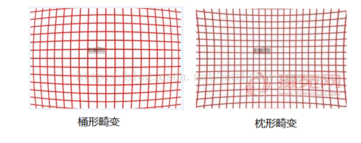
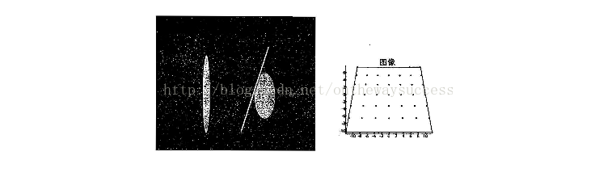
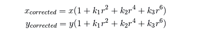
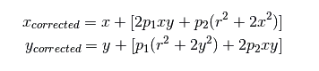
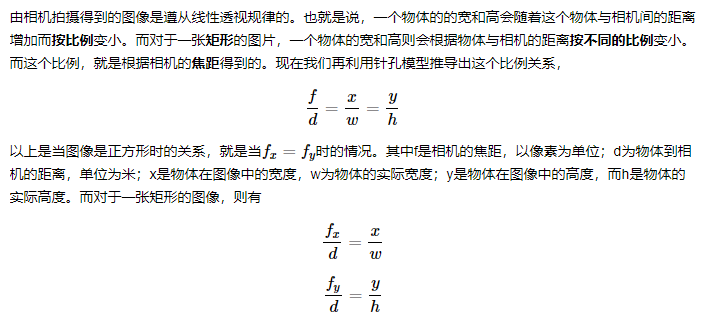
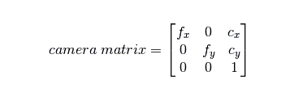
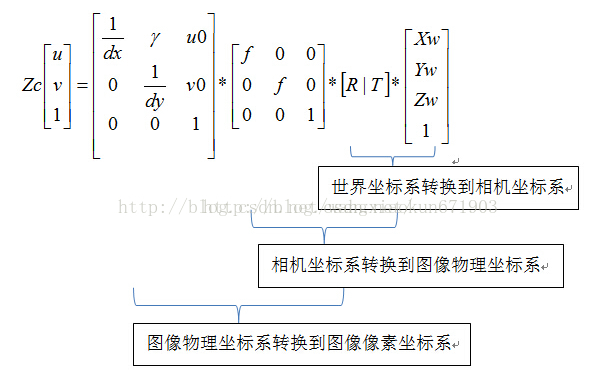

> 在进行一些项目的过程中产生的笔记。

# python知识拾遗
## assert 断言
assert 后面紧跟布尔型语句，如若布尔型语句有误则会引发assert异常，并输出布尔型语句后的字符串（如果有的话）。
例子如下：
```python
import cv2
assert cv2.__version__[0]=='3', 'opencv的版本必须为3'
```


# 相机标定部分学习
## 径向畸变与切向畸变
什么是径向畸变：径向畸变用来描述这样一种现象，即图像边缘位置的弯曲总是比图像中间的弯曲来得强烈。如图所示：

什么是切向畸变：切向畸变是指透镜不完全平行于图像平面。如图所示：

对于径向畸变，一般可以采用如下方式进行解决：

对于切向畸变，一般可以采用如下方式解决：

因而我们需要5个参数来描述整个摄像机的畸变情况，称之为畸变系数（distortion coefficients）

其中k1，k2，k3为径向畸变系数，p1，p2为切向畸变系数。
## 内参——摄像头矩阵
但是思考一下，仅仅有了以上的东西，我们就可以描述一个摄像头的物理特性了吗？自然不是！

我们需要得到摄像头的焦距（fx，fy），光学中心（cx，cy）等等，这些特性将会直接被使用。

相机的焦距是指的相机透镜到相机成像处的距离。相机的针孔模型中含有这个参数变量。但是，对于实际的相机，往往有两个参数fx，fy。对他们的解释如下：

光学中心则是指的从图像的像素原点到图像的中心点所需要的横纵像素个数。

总之，我们最终可以得到如下的一个矩阵，来描述相机的内参数：



# 三大坐标系
首先上图：
