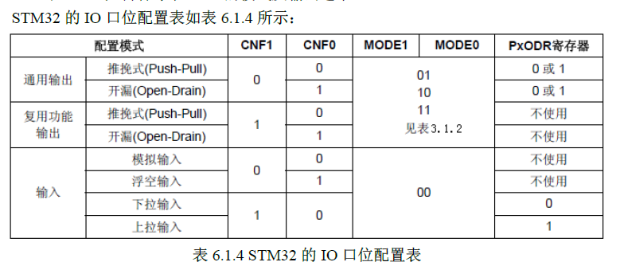
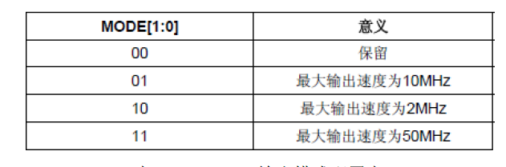
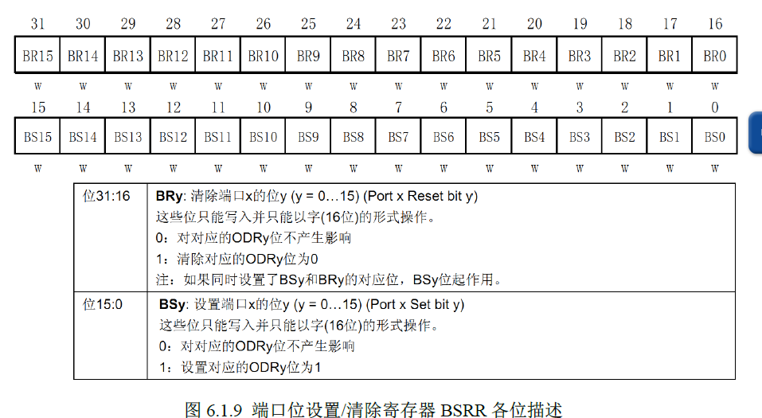

# stm32 笔记 一 GPIO（一）

存放地址：./FWLib/stm32f10x_gpio.c

IO口可以配置的8种模式：

1. 输入浮空
2. 输入上拉
3. 输入下拉
4. 模拟输入
5. 开漏输出
6. 推挽输出
7. 推挽式复用功能
8. 开漏复用功能



## 端口低配置寄存器 CRL
1. 复位值：0x4444 4444（相当于是浮空输入）
2. 控制每个IO端口（A~G）的低八位模式
3. 每个IO端口的位占用CRL的四个位，高两位是CNF，低两位是MODE
### 常用配置：

1. 0x0：模拟输入模式（ADC用）
2. 0X3：推免输出模式（做输出口用，50M速率）

> CRH与CRL相似，只不过控制的是高八位。

## GPIO相关函数之 GPIO_init(GPIO_TypeDef* GPIOx, GPIO_InitTypeDef* GPIO_InitStruct):

### 参数说明

GPIO_TypeDef:代表的是指定的io接口（GPIOA~GPIOG）

GPIO_InitTypeDef* : 初始化参数结构体指针

结构体的定义为：
```c
typedef struct
{
  uint16_t GPIO_Pin;           /*这里的Pin是用来指定对哪一个或者哪些端口进行初始化*//*!< Specifies the GPIO pins to be configured.
                                      This parameter can be any value of @ref GPIO_pins_define */

  GPIOSpeed_TypeDef GPIO_Speed;  /*IO串口的传输速度*//*!< Specifies the speed for the selected pins.
                                      This parameter can be a value of @ref GPIOSpeed_TypeDef */

  GPIOMode_TypeDef GPIO_Mode;    /*IO端口的输入输出模式（前面已经给出）*//*!< Specifies the operating mode for the selected pins.
                                      This parameter can be a value of @ref GPIOMode_TypeDef */
}GPIO_InitTypeDef;
```

在跑马灯示例中对一个接口的初始化代码为：
```csharp?linenums
GPIO_InitStructure.GPIO_Pin = GPIO_Pin_8;				 //LED0-->PA.8 端口配置
 GPIO_InitStructure.GPIO_Mode = GPIO_Mode_Out_PP; 		 //推挽输出
 GPIO_InitStructure.GPIO_Speed = GPIO_Speed_50MHz;		 //IO口速度为50MHz
 GPIO_Init(GPIOA, &GPIO_InitStructure);					 //根据设定参数初始化GPIOA.8
 GPIO_SetBits(GPIOA,GPIO_Pin_8);						 //PA.8 输出高
```
其中对Mode属性的初始化在MDK中是用一个枚举进行定义的：
```csharp?linenums
typedef enum
{ GPIO_Mode_AIN = 0x0,//模拟输入
  GPIO_Mode_IN_FLOATING = 0x04,//浮空输入
  GPIO_Mode_IPD = 0x28,//下拉输入
  GPIO_Mode_IPU = 0x48,//上拉输入
  GPIO_Mode_Out_OD = 0x14,//开漏输入
  GPIO_Mode_Out_PP = 0x10,//通用推免输出
  GPIO_Mode_AF_OD = 0x1C,//复用开漏输出
  GPIO_Mode_AF_PP = 0x18//复用推免
}GPIOMode_TypeDef;
```
## 端口输入数据寄存器 IDR  &&端口输出寄存器ODR
### IDR
只能以16位的形式读出，只读（r）。低16位（对应着一个IO口的16个引脚）。
可以通过读取这个寄存器的某个位的状态来获得那个IO口的引脚的电平状态。
读取函数：
```csharp?linenums
uint8_t GPIO_ReadInputDataBit(GPIO_TypeDef* GPIOx, uint16_t GPIO_Pin)
```
返回的是1（SET）或者0（RESET）。
### ODR
只能以16位的形式输出，可读可写（rw）。可读相当于判断当前IO口的输出状态，而可写相当于控制IO口的输出电平是高还是低。
读取函数：
```csharp?linenums
void GPIO_Write(GPIO_TypeDef* GPIOx, uint16_t PortVal);
//示例代码：GPIO_Write(GPIOD,0x0100)   //使PD8置高   这个定要认真理解！！！！！
```
## BSRR寄存器——端口位设置/清除寄存器

这个寄存器也可以控制端口的输出，首先给出这个寄存器的内部结构：


对端口的低位（低16位）送1表示置1，高位置1表示置0；注意：所有的寄存器都是32位的
例子：
```csharp?linenums
GPIOA ->BSRR=1<<1; //这里表示对AIO接口的1号端口（引脚）置高电平
GPIOA ->BSRR=1<<(16+1);//置低电平
```
在这里必须要解释一下这两行容易误导人的代码：首先控制的是A口的“1”号端口，这个“1”是代码中的<<右边的1，左边的1代表的是把右边的1的数置为1。
由于之前的寄存器都是只有前16位有效，后16位不起作用，所以这里没有太好的理解。事实是这样的：一个端口对应着32位寄存器中的两个数字（比如
0号端口对应着0和16,1号端口对应着1和（16+1），这就是上面的代码的原理）

## BRR寄存器——端口位清零寄存器

功能与BSRR的高16位雷同。

如若通过固件库函数来进行实现，则可以将之变为：
```csharp?linenums
void GPIO_SetBits(GPIO_TypeDef* GPIOx, uint16_t GPIO_Pin);
void GPIO_ResetBits(GPIO_TypeDef* GPIOx,uint16_t GPIO_Pin);
```
## IO操作步骤总结：

1. 使能IO口时钟;
```csharp?linenums
RCC_APB2PeriphClockCmd(  );
```
2. 初始化IO参数，调用GPIO_init();
3. 利用上述的寄存器和固件库函数操作IO.