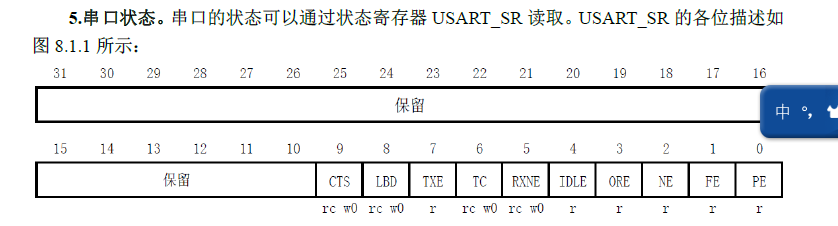
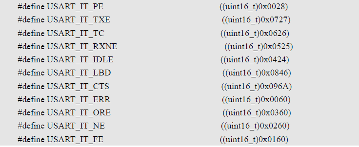
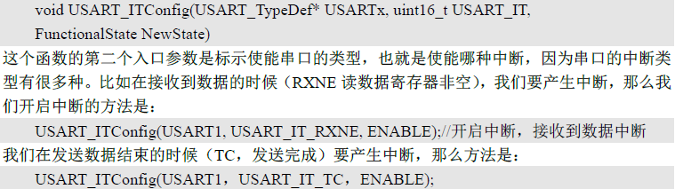
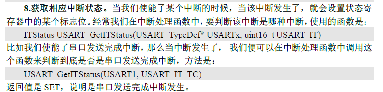
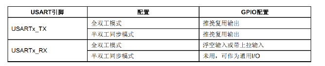

# stm32 学习笔记 二

## 串口

MCU：微控制单元，可以指单片机。
miniSTM32开发板：一个USB串口，一个RS232串口。

### 串口设置的基本步骤：
1. 串口时钟使能，GPIO使能
```csharp?linenums
 RCC_APB2PeriphClockCmd(RCC_APB2Periph_USART1);
```
2.  串口复位
该函数用于初始的函数配置时，也可以用于外设异常时，其函数为：
```csharp?linenums
void USART_DeInit(USART_TypeDef* USARTx);
```
3. GPIO端口模式设置
这一部分在上一个笔记中已经有记录了。
4. 串口参数初始化
```csharp?linenums
void USART_Init(USART_TypeDef* USARTx, USART_InitTypeDef* USART_InitStruct);
```
与在GPIO中的IO口初始化相似，这里的初始化模块也是被定义的，命名规则也一样。现在把他给出：
```c
typedef struct    //最常用  1停止位 无奇偶校验位 8位字长传输
{
//串口的波特率
  uint32_t USART_BaudRate;            /*!< This member configures the USART communication baud rate.
                                           The baud rate is computed using the following formula:
                                            - IntegerDivider = ((PCLKx) / (16 * (USART_InitStruct->USART_BaudRate)))
                                            - FractionalDivider = ((IntegerDivider - ((u32) IntegerDivider)) * 16) + 0.5 */
//串口的字长，8位  
  uint16_t USART_WordLength;          /*!< Specifies the number of data bits transmitted or received in a frame.
                                           This parameter can be a value of @ref USART_Word_Length */
//停止位，告诉串口有几个停止位
  uint16_t USART_StopBits;            /*!< Specifies the number of stop bits transmitted.
                                           This parameter can be a value of @ref USART_Stop_Bits */
//是否进行奇偶校验
  uint16_t USART_Parity;              /*!< Specifies the parity mode.
                                           This parameter can be a value of @ref USART_Parity
                                           @note When parity is enabled, the computed parity is inserted
                                                 at the MSB position of the transmitted data (9th bit when
                                                 the word length is set to 9 data bits; 8th bit when the
                                                 word length is set to 8 data bits). */
 //串口模式(收，发)
  uint16_t USART_Mode;                /*!< Specifies wether the Receive or Transmit mode is enabled or disabled.
                                           This parameter can be a value of @ref USART_Mode */
//是否进行硬件流控制
  uint16_t USART_HardwareFlowControl; /*!< Specifies wether the hardware flow control mode is enabled
                                           or disabled.
                                           This parameter can be a value of @ref USART_Hardware_Flow_Control */
} USART_InitTypeDef;
```
下面给出上面的这些属性对应的一些宏定义：

>关于wordlength：
```c
#define USART_WordLength_8b                  ((uint16_t)0x0000)
#define USART_WordLength_9b                  ((uint16_t)0x1000)
```
可以看出只有8b和9b两个选项。
>关于数据的发送与接收：
>通过数据寄存器USART_DR来实现，这是一个双寄存器，包括TDR（发送的）与RDR（负责接收的）
>当向寄存器写数据时窗口会自动发送，收到数据时也会储存在该寄存器内。

下面是收发数据的库函数：
```csharp?linenums
void USART_SendData(USART_TypeDef* USARTx, uint16_t Data);//发送数据的函数

uint16_t USART_ReceiveData(USART_TypeDef* USARTx);//发送数据的函数
```

5. 开启中断 并且初始化NVIC

6. 使能串口

7. 编写中断处理函数

> 串口基本配置相关的固件库函数位于usart中
### 串口状态查看 USART_SR寄存器

仍然是那句话，stm32中所有的寄存器都是32位的。下面是里面的每个位的功能：

#### RXNE（读数据寄存器非空）
当此位为1代表寄存器接收到了信号，此时可以去读取USART_DR，这种读取会使得RXNE清零，当然也可以认为置零。
#### TC（发送完成）
当这个位被置1表明数据寄存器USART_DR数据已经发送完成。
如果设置了这个位的中断，则会产生中断。该位支持两种清除方式：
1. 读SR，写DR
2. 直接置零

> 其他位见参考手册。
固件库函数中读取串口状态的函数为：
```c
FlagStatus USART_GetFlagStatus(USART_TypeDef* USARTx, uint16_t USART_FLAG);
```
其中第二个入口参数代表的是需要查看的寄存器的哪种状态，比如：
>USART_FLAG_RXNE
USART_FLAG_TC

这些在宏定义中都是被定义好了的。


#### 串口使能
通过USART_Cmd()实现
#### 开启串口响应中断



下面依据上面的给出一组关于串口初始化函数的源代码：
这个源代码位于system/usart.c中
```c
void uart_init(u32 bound){
	GPIO_InitTypeDef GPIO_InitStructure;
	USART_InitTypeDef USART_InitStructure;
	NVIC_InitTypeDef NVIC_InitStructure; //NVIC,提供中断控制器，是做中断用的
	 
	RCC_APB2PeriphClockCmd(RCC_APB2Periph_USART1|RCC_APB2Periph_GPIOA, ENABLE);	//使能USART1，GPIOA时钟
  
	//USART1_TX   GPIOA.9
  GPIO_InitStructure.GPIO_Pin = GPIO_Pin_9; //PA.9
  GPIO_InitStructure.GPIO_Speed = GPIO_Speed_50MHz;
  GPIO_InitStructure.GPIO_Mode = GPIO_Mode_AF_PP;	//复用推挽输出
  GPIO_Init(GPIOA, &GPIO_InitStructure);//初始化GPIOA.9
   
  //USART1_RX	  GPIOA.10初始化
  GPIO_InitStructure.GPIO_Pin = GPIO_Pin_10;//PA10
  GPIO_InitStructure.GPIO_Mode = GPIO_Mode_IN_FLOATING;//浮空输入
  GPIO_Init(GPIOA, &GPIO_InitStructure);//初始化GPIOA.10  

  //Usart1 NVIC 配置
  NVIC_InitStructure.NVIC_IRQChannel = USART1_IRQn;
	NVIC_InitStructure.NVIC_IRQChannelPreemptionPriority=3 ;//抢占优先级3
	NVIC_InitStructure.NVIC_IRQChannelSubPriority = 3;		//子优先级3
	NVIC_InitStructure.NVIC_IRQChannelCmd = ENABLE;			//IRQ通道使能
	NVIC_Init(&NVIC_InitStructure);	//根据指定的参数初始化VIC寄存器
  
   //USART 初始化设置

	USART_InitStructure.USART_BaudRate = bound;//串口波特率
	USART_InitStructure.USART_WordLength = USART_WordLength_8b;//字长为8位数据格式
	USART_InitStructure.USART_StopBits = USART_StopBits_1;//一个停止位
	USART_InitStructure.USART_Parity = USART_Parity_No;//无奇偶校验位
	USART_InitStructure.USART_HardwareFlowControl = USART_HardwareFlowControl_None;//无硬件数据流控制
	USART_InitStructure.USART_Mode = USART_Mode_Rx | USART_Mode_Tx;	//收发模式

  USART_Init(USART1, &USART_InitStructure); //初始化串口1
  USART_ITConfig(USART1, USART_IT_RXNE, ENABLE);//开启串口接受中断
  USART_Cmd(USART1, ENABLE);                    //使能串口1 

}
```
在这里面可以看到与串口通信连接的两个端口在模式上被设置成了PP与IN_FLOATING，这个的依据如下：

在这里面估计最难理解的就是那个NVIC了，现把其初始化的结构体摘录于下：
```c
typedef struct
{
  uint8_t NVIC_IRQChannel;                    /*!< Specifies the IRQ channel to be enabled or disabled.
                                                   This parameter can be a value of @ref IRQn_Type 
                                                   (For the complete STM32 Devices IRQ Channels list, please
                                                    refer to stm32f10x.h file) */

  uint8_t NVIC_IRQChannelPreemptionPriority;  /*!< Specifies the pre-emption priority for the IRQ channel
                                                   specified in NVIC_IRQChannel. This parameter can be a value
                                                   between 0 and 15 as described in the table @ref NVIC_Priority_Table */

  uint8_t NVIC_IRQChannelSubPriority;         /*!< Specifies the subpriority level for the IRQ channel specified
                                                   in NVIC_IRQChannel. This parameter can be a value
                                                   between 0 and 15 as described in the table @ref NVIC_Priority_Table */

  FunctionalState NVIC_IRQChannelCmd;         /*!< Specifies whether the IRQ channel defined in NVIC_IRQChannel
                                                   will be enabled or disabled. 
                                                   This parameter can be set either to ENABLE or DISABLE */   
} NVIC_InitTypeDef;
```
给出源代码中的优先级表：
```c
/**
@code  
 The table below gives the allowed values of the pre-emption priority and subpriority according
 to the Priority Grouping configuration performed by NVIC_PriorityGroupConfig function
  ============================================================================================================================
    NVIC_PriorityGroup   | NVIC_IRQChannelPreemptionPriority | NVIC_IRQChannelSubPriority  | Description
  ============================================================================================================================
   NVIC_PriorityGroup_0  |                0                  |            0-15             |   0 bits for pre-emption priority
                                         |                                    |                             |   4 bits for subpriority
  ----------------------------------------------------------------------------------------------------------------------------
   NVIC_PriorityGroup_1  |                0-1                |            0-7              |   1 bits for pre-emption priority
                                         |                                     |                             |   3 bits for subpriority
  ----------------------------------------------------------------------------------------------------------------------------    
   NVIC_PriorityGroup_2  |                0-3                |            0-3              |   2 bits for pre-emption priority
                                         |                                     |                             |   2 bits for subpriority
  ----------------------------------------------------------------------------------------------------------------------------    
   NVIC_PriorityGroup_3  |                0-7                |            0-1              |   3 bits for pre-emption priority
                                         |                                     |                                  |   1 bits for subpriority
  ----------------------------------------------------------------------------------------------------------------------------    
   NVIC_PriorityGroup_4  |                0-15               |            0                |   4 bits for pre-emption priority
                                         |                                      |                              |   0 bits for subpriority                       
  ============================================================================================================================
@endcode
*/
```
这里我想应该更进一步地引申一下NVIC。


