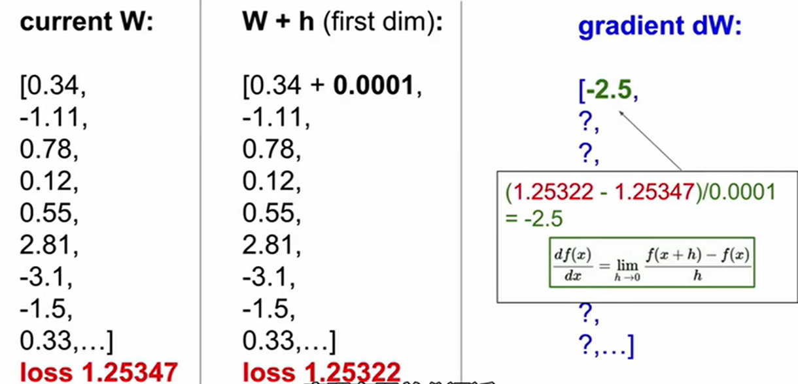

# optimzation
## random search
这是一种很坏的方法，这里就不进行介绍。略过。
## gradient （偏导组成的向量）
>negative gradient is the direction of the deepest descent direction.
>梯度方向的反方向就是下降最快的方向。

梯度是一种一阶线性逼近。有限差分法用来对梯度进行计算（逼近）。

如上图所述，将权重中的某一个分量做微小变化，利用损失值的变化量除以分量的变化量就可以得到该分量的偏导值。
但是这样的缺点是计算量太大，速度会非常慢。
其实只要使用dL/dW=x,也就是把x的数值当做偏导值就可以了。。。。
### gradient descent（梯度下降法）

这个之前学习过，不多说。
### SGD（stochastic gradient descent）

这个之间也讲过，主要是一个minibatch的思想。此处只是走一走过场。
# image feature
在神经网络大量应用之前，一般都不是直接将图像的像素传入线性分类器，而是先提取其特征，之后将之传入分类器。
提取特征有很多例子；
## color histogram（颜色直方图）

如图所示，颜色直方图指对一张图片分别统计其在不同的颜色类（频谱，光谱）中的像素个数得到的直方图。
## HoG（Histogram of Oriented Gradients）方向梯度直方图

主要提出思想是：认为人眼能够识别图像很大一部分来自于边缘，于是可以对图像进行分块（图中是8 * 8），求出每一小块的梯度特征（一个像素一个梯度），并将所有的梯度分为9类（也就是图中的9bins），统计之后得到其梯度直方图；这样一个8 * 8的小块内就会拥有9个数字来表征这个小块的梯度特征，将所有的数字组成向量就可以得到HOG特征了。
## Bag of Words(词袋)

这个灵感来自于NLP，指在NLP中对一个句子运用特征向量进行特征表示，可以是统计每个单词出现的频率。而在图片里，可以对一堆图片都切成很小的块，并且对每一块进行主要颜色的统计，得到图片的直方图，直方图中的每个颜色的数量作为特征向量。

