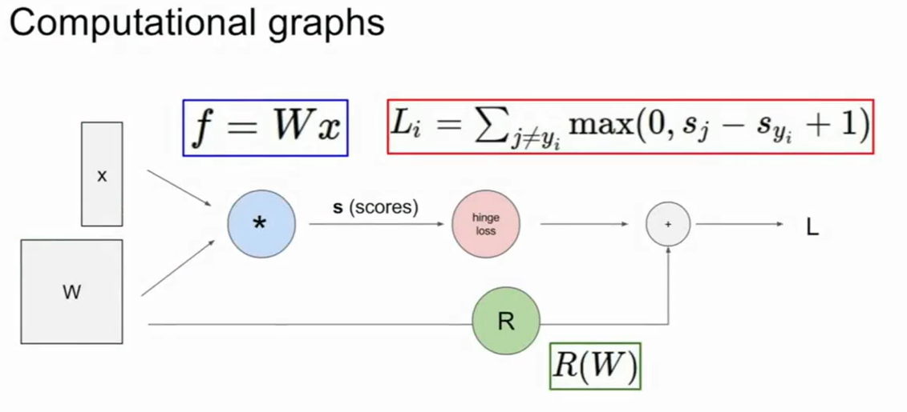
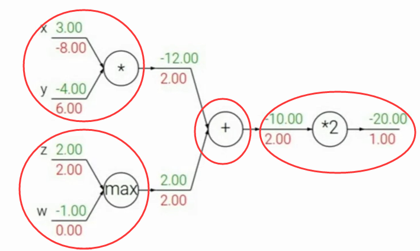
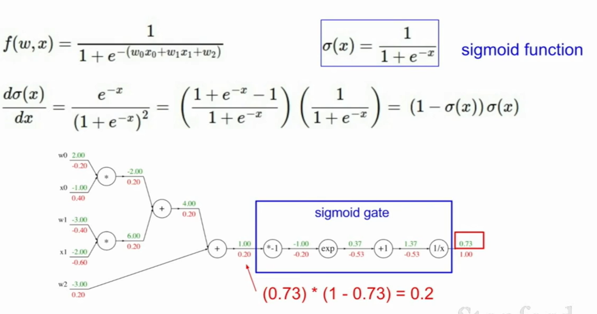
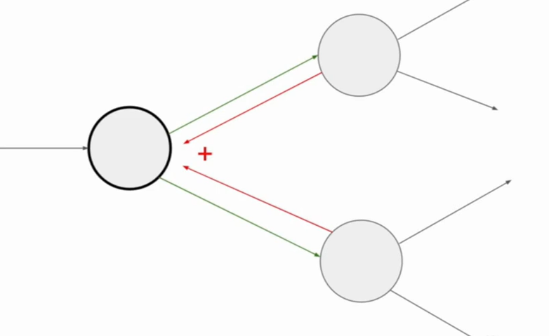
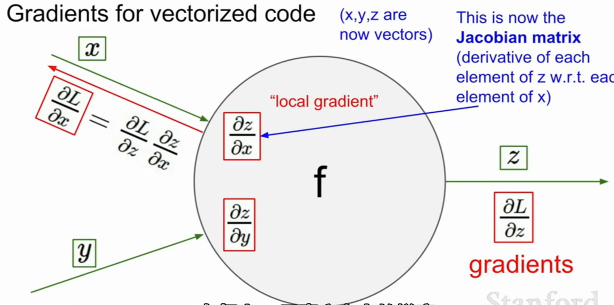
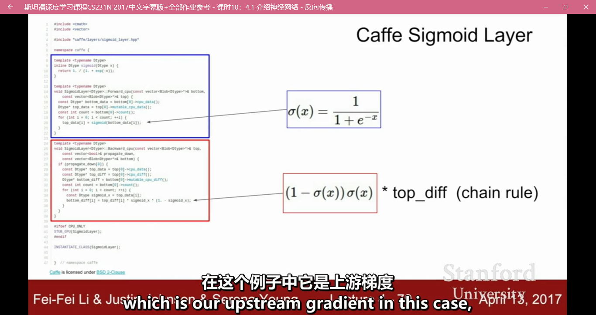

>这篇笔记来源于追番——CS231N。

# Computational Graphs
比如，线性分类器（包括计算损失函数和正则项）的计算图可以表示如下：

有了计算图的概念之后，就可以调用链式法则实行反向传播算法了。

计算图中的节点可以简单也可以复杂，但是必须要能够足以计算出节点处的梯度变化。

基本上任何表达式都可以被表示为计算图。

下面是几个例子，希望能从中学习：(蓝色的是正向传播的数值，红色的是反向传播的梯度)

此外，当一个节点连接到后面的多个节点时，反向传播的梯度会随着链式法则在此处累加。如下图：

此外，如果输入的不是一个数x而是一个向量X，那么显然得到的输出仍然是一个向量，为偏导向量于雅可比矩阵的乘积。

下面给出一个矩阵反向求导的例子作为补充:

注意，原PPT里给的应该是出错了，需要加一个转置才对。

caffe中的源码示例：

