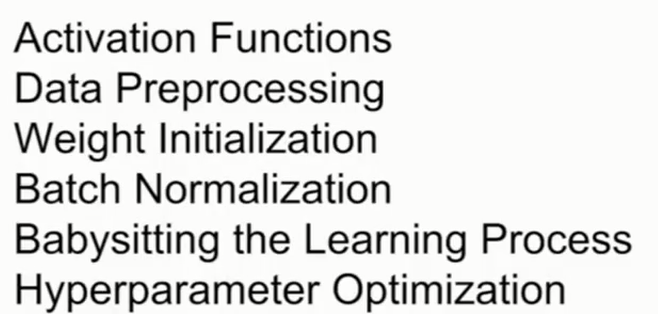
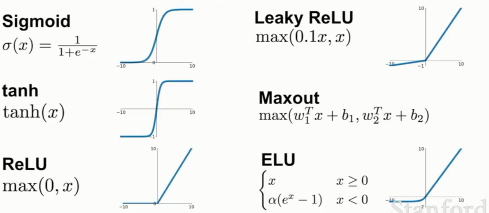
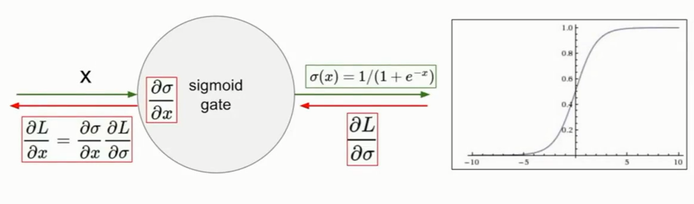
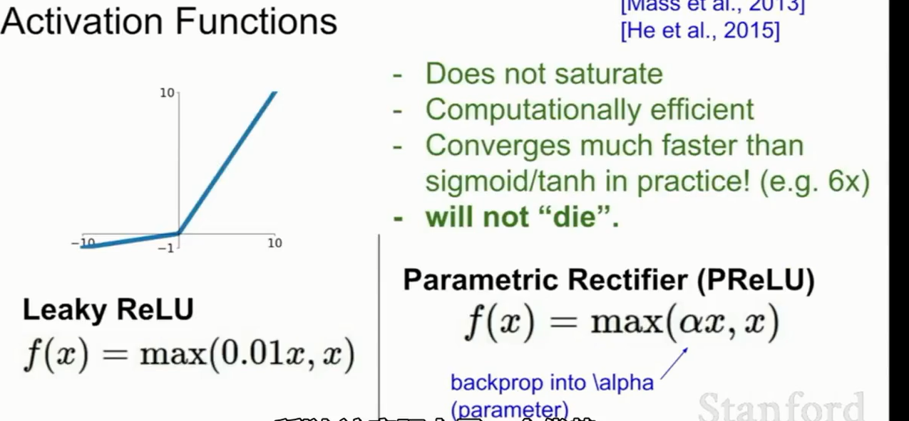
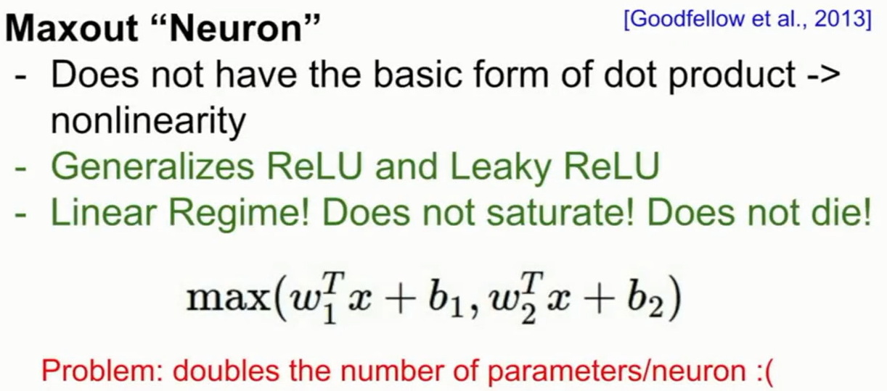
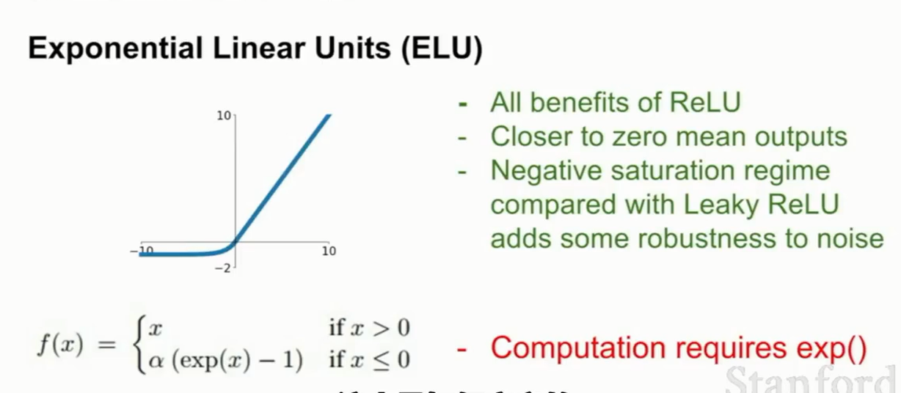
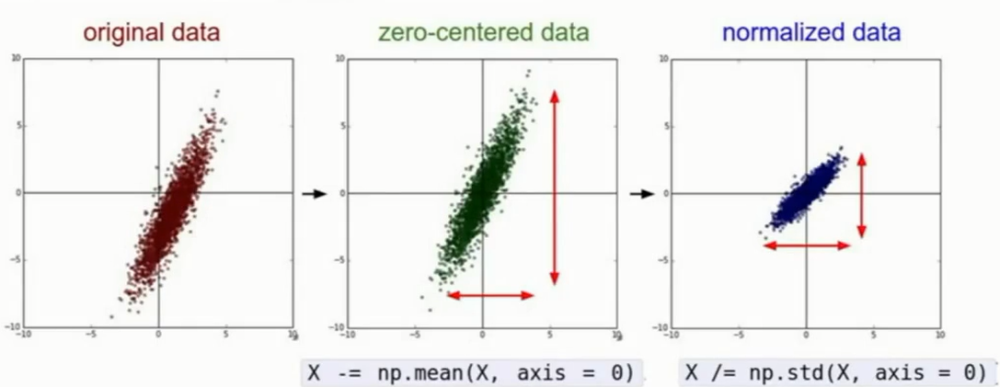
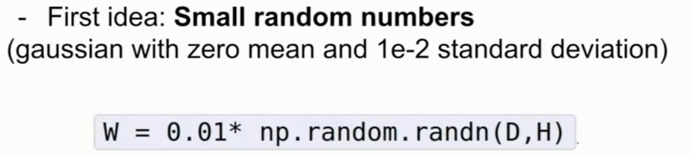
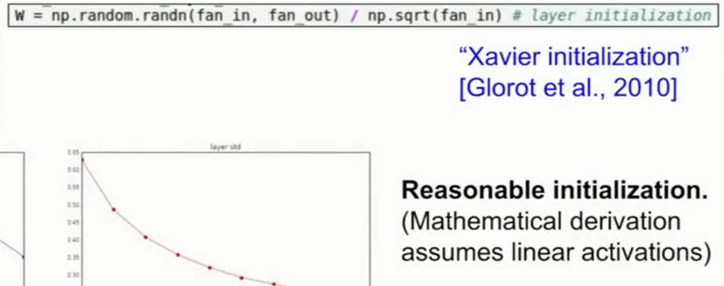
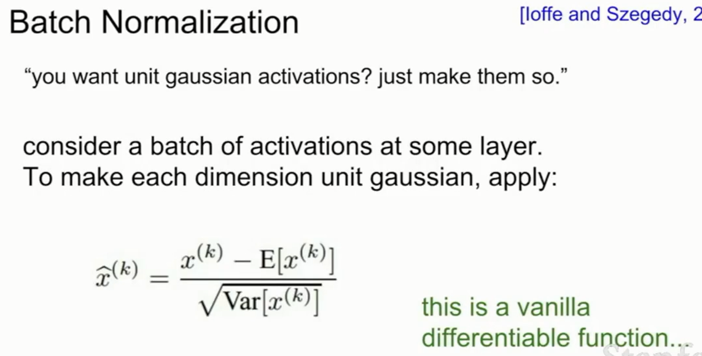

>这篇笔记主要是学习了CS231N之后的结果

主要包括以下几个方面：

#Avtivation Functions
这个之前已经学习过，这里简略写出。
常见的激活函数：

## sigmoid
sigmoid函数容易产生梯度消失现象：

即两个极端处的梯度为0

另外一个缺点是无法实现以0为中心的映射，即所有的映射结果都在0之上。为了解决这个问题，可以使用反正切函数（tanh），他将结果折射在了-1到1之间。
## Relu
被实际使用证明了具有良好的效果。
该激活函数也存在几个问题：
1. 非以0为中心，仍然存在偏置
2. 在小于0的部分梯度消失
为了解决这个问题，出现了些新的方法，比如：
### Leaky Relu & Parametric RELU

解决了梯度消失问题
### Maxout Neuron

取两个神经元中结果最大的作为最终的输出，问题在于这样会加大计算量，但是却解决了梯度消失的问题。
### ELU

也是解决了梯度消失的问题，并且还增加了对噪声的防干扰性

# Data Preprocessing
机器学习中一般需要的对数据进行的处理：

拿到原始数据，之后取均值，然后正则化（除以方差）。
但是对于深度学习中的图像处理，一般不进行正则化的操作，因为图像的数值域彼此之间差距不大，没有必要按照一个比例缩小。
# Weight Initialization
不能全部使用0来进行初始化。
可以尝试使用小的随机数：

也可以使用较大的随机数。
如何来衡量这些呢？衡量的方法大致是

# Batch Normalization

