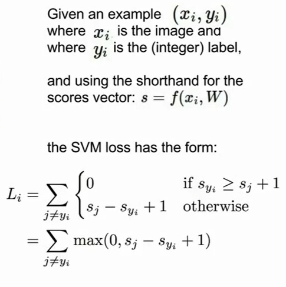
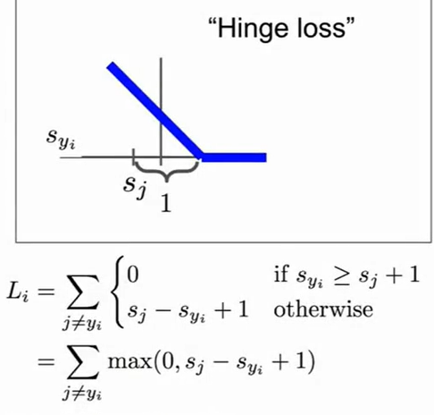
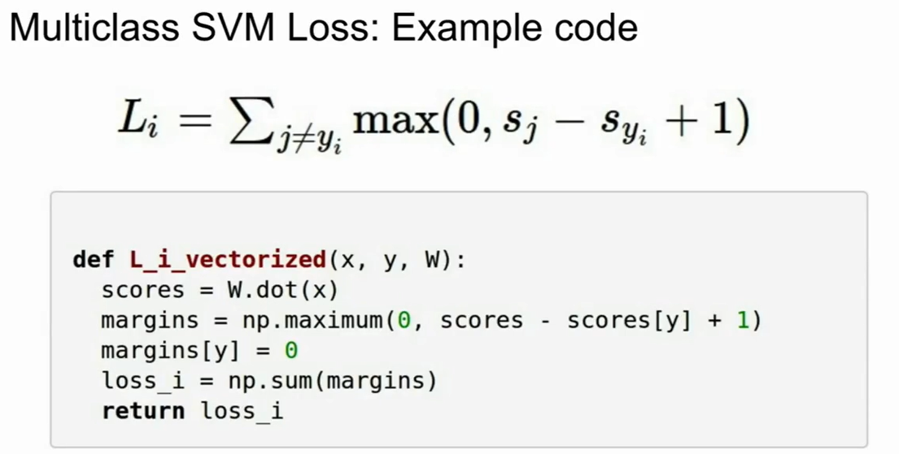
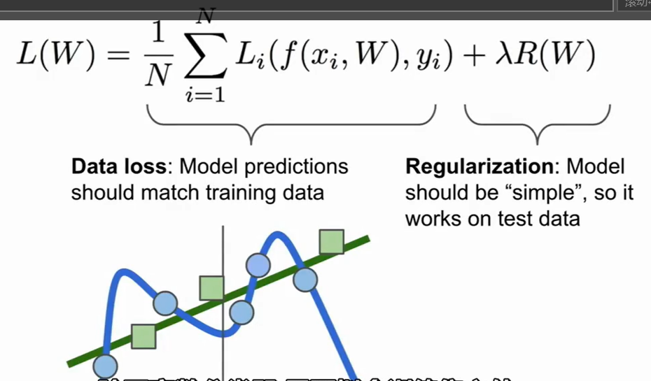
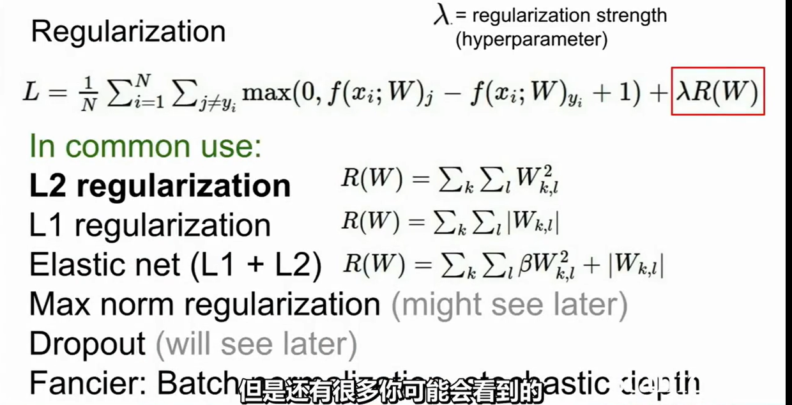
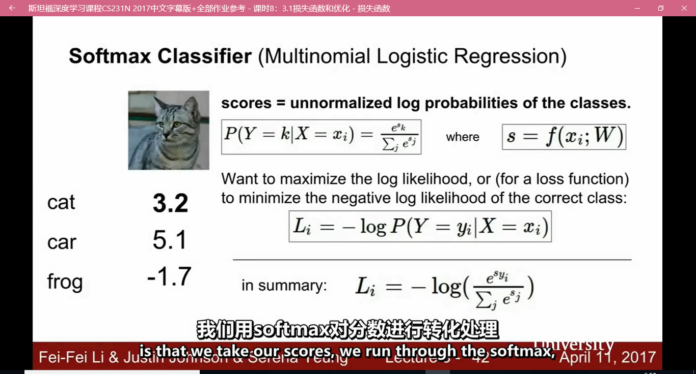

>一点点地找，不着急！
CS231N笔记系列

# Multiclass SVM loss

x_i相当于输入的图像对应的向量数列，y_i相当于是x_i对应的图像标签（已经被转化为了整数）。
s则代表得到了的预测值，这是线性分类器得到的预测值（这个预测值其实是一组，即对每一个分类都会有一个预测值，数值越大代表可能性越高）

所谓的对SVM LOSS的定义则是如此：

Hinge Loss即为合页损失的意思。
对于这个表达式做一下理解：
L_i代表对第i张图片的损失的计算，预测的类别一共有X类，对于这X类中每一个不和实际标签y_i相同的情形j，都要判别预测值S_j（代表分类器对第j类的预测分数）和S_y_i（代表分类器对标签结果也就是y_i这个类的预测分数）的关系。如若：
Syi>=Sj+1，那么损失就为0，否则，损失就是Sj+1-Syi。这就是SVM LOSS。

对于上述思想使用numpy实现：

这种迭代化的窍门还是值得去学习的。

# Regularization(正则化)
正则化的出现是为了防止overfitting。

从图中最上方的公式中也可以察觉到，损失函数应该包括两项，损失项和正则项。
其中正则项里的超参数 $/lamda$则是调节的重点。
下面是一些常见的正则项（主要是利用范数）

还有一些其他的名词：
1. dropout
2. batch nomalization(批量归一化)
3. stohastic depth(随机深度)
这些都是正则化手段。
正则化的根本目的是为了简化模型的复杂度，而非更好的拟合模型。
# softmax classifier（multinomial logistic regression）

这是最经常使用的softmax损失函数。一方面，线性分类器的输出进行指数化和归一化，这样能够确保得到的评分全部都是正数，且总和为1，这样就满足了概率的概念。之后是对损失函数的定义，这里就十分之简单且精妙了，对于第i张图片，计算其损失只需要计算出现了标签结果的评价概率的对数值再取负号就可以了（得到的结果仍然是一个正数，且和概率值成反比）。

综上所出现的一整套流程则被称为supervised learning

