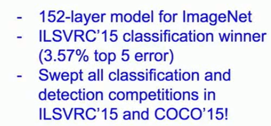

> 本笔记参考于李飞飞CS231N课程

> 这篇文章主要整理了自2012年以来出现在ImageNet上的经典的、也是很高效的计算机视觉相关的神经网络架构。主要包括：
1. AlexNet
2. VGG
3. GoogleNet
4. ResNet
还有一些其他的神经网络，包括：
1. NiN(Network in Network)
2. Wide Resnet, ResneXT
3. Stochastic Depth
4. DenseNet
5. FractalNet 
6. SqueezeNet

# AlexNet
## Architecture

## train parameters

# VGGNet
## Architecture

使用了尺寸较小的卷积核（1*1,3*3），这样就可以使得网络可以更深
## train parameters

可以看出，训练量巨大，参数巨多，占用内存也巨多。

其中，耗费内存的地方在于前面的convlayer，而参数众多的位置在后面的FC layer。
# GoogleNet
## Architecture
### FULL Architecture

### Inception Module
由inception module组成。

对于inception module，可以看下图

可以看出这里就是将各种不同大小的卷积核并联起来（包括了池化层），然后将其结果作为输出。
由于池化层会保留深度，所以inception之后的层的尺寸一定会增加，因此必须采用其他的措施减小输出的维度。
解决方案：通过1* 1的卷积核来实现。（bottelNeck Layer）。
### bottle Neck 

方案很简单，就是通过1* 1尺寸的卷积核来进行降维。

这样就从过去的672变成了现在的480
## 特点
与VGG相比较的特点：

# ResNet(残差神经网络)
## 同样的这里是其特点：

## Architecture
残差神经网络的特点就是不再将神经网络作为一种x->f(x)的映射来看待，而是转换为另外一种思路：
即输出应该是输入在某一种程度上的修正，即y=x+zelta_x 。神经网络在这里不再尝试去得到那个映射关系，而是去尝试得到那个修正的zelta。这样多层连接之后的结果
就和函数的泰勒展开特别相似。下面给出一个结构图：

可以看到这个结构还是很简单的。总体的结构如下：

## train detail
训练细节：

相关的实验结果

# Summary1
上述框架的效果总结：

其中柱状图中柱子越低越好。
还有效果图：

左图中的表现的是分类的精确程度，右图的横坐标是计算复杂度（作者说操作度），纵坐标是精确度，圆圈的大小代表占用的memory。
可以看出ResNet与Inception的效果还是很棒的，Alex的精确度不好，VGG效率不太好。
# 其他
## NiN（Network in Network）

同样是对ResNet的改进：

## Wide Residual Network

认为不仅仅要提高神经网络的深度，还要使得层变宽（增多卷积核的数目）。这也是对ResNet的一个改进。
## ResNeXT
同样是想增加层的宽度，但是并没有增加卷积核的数目，而是增加了支路数。有点类似于inception module的感觉。

可以看出，他是先用1* 1* 4的卷积核（bottle Neck）让输入变瘦，之后输出再复原、拼接。总体上仍是一个残差神经网络。
## Stochastic Depth
为了解决深层时出现的梯度消失问题。

与dropout层有一点相同的感觉，只不过是这里不是让W和B不起作用，而是让某一部分的残差模块不起作用，如上图。
## Fractal Net

作者说残差是不必要的，因此建立了这么一个模型。我却认为这个模型事实上是和ResNet等价的。
这种等价可以使用泰勒公式的展开作为阐述。
## DenseNet

同样地被用来作为一种缓解梯度消失的手段。可以看见每一层的输入是前面所有层的输出。所以每一层都被很好的训练了，但是这样的话计算量会很大。
## SqueezeNet
这个主要是寻求一种高效性。

这个讲的不够深刻，说是后面展开。